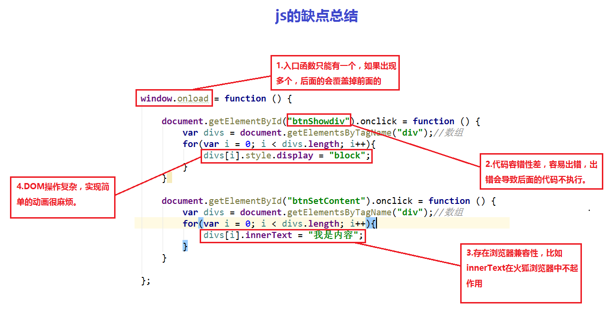
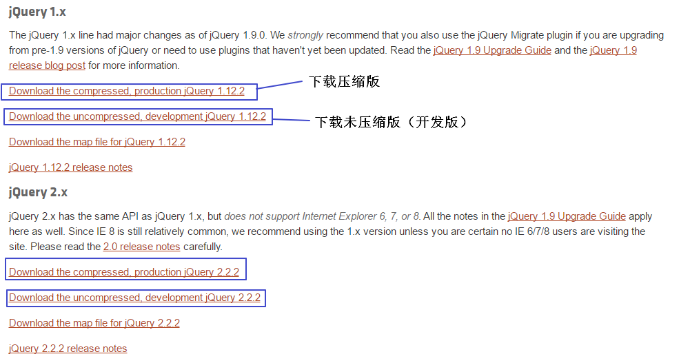

# jQuery简介

 - jQuery让js的开发变得更加简单

 - jQuery解决了浏览器的兼容性问题

## jQuery基本概念

## 为什么要学习jQuery？



##  什么是jQuery？ 

- **jquery的官网:**http://jquery.com/

  - 说白了：jQuery就是一个js库，使用jQuery的话，会比使用JavaScript更简单。

  - js库：把一些常用到的方法写到一个单独的js文件，使用的时候直接去引用这js文件就可以了。（animate.js）


## 学习jQuery，主要是学什么呢？

- 学习jQuery，主要学习jQuery的一大堆的api。

- API：application programming interface：应用程序编程接口，说白了，API就是方法。

> obj.funName(params);

- 注意：方法调用的时候，都带小括号(),使用jQuery的方法的时候，不要忘了小括号。


## 怎样使用jQuery？

- 下载jquery

  官网下载地址：http://jquery.com/download/

  
- jQuery的文件相关内容：
	- 下载文件：https://cdnjs.com/libraries/jquery/





## jQuery详细解释

- **版本介绍**

    - 根据版本jQuery一共分为3类
    - jquery大版本分为1.x和2.x（3.0）
      
      **区别：2.x版本不再支持IE6/7/8**

>     1.x： 兼容所有现代浏览器（ie678和其他浏览器），使用最为广泛
>
>     1.12.4 是1.x的最新版本，不会再设置新功能了
>
>     2.x： 不支持ie678,几乎没人用
>
>     3.x： 不支持ie678,官方主要更新维护的版本


- 同一版本分类

> jQuery每一个版本又分为压缩版和未压缩版：
>
> jquery.js：未压缩版本（开发版本），代码可读性高，推荐在开发和学习阶段使用，方便查看源代码。
>
> jquery.min.js：压缩版本，去除了注释、换行、空格、并且将一些变量替换成了a,b,c之类的简单字符，基本没有可读性，推荐在项目生产环境使用，因为文件较小，减少网络压力。
>
> 3.x版本还提供了精简版，删除了部分功能，体积小。


- **关于jquery3.0**
  
  翻译：jquery3.0现在发布了，这个版本自从2014年10月就开始测试了，我们的目标是创建一个更苗条、更快的jquery版本（并且能向后兼容）。我们已经移除了IE旧版本的解决方案，并且带来了一些较为现代的web API，但这是有道理的。3.0是2.x分支的延续，但是有一些突破性的改变。但是1.12和2.2分支将会在同一时间继续获得关键性的支持补丁。但是他们不会再有任何新的功能和重大的修订。jQuery3是jQuery的未来，如果你需要兼容IE6-8，你可以继续使用1.12版本。

- **引包的注意点**
    - 忘记引包或者引包在入口函数的后面。
      

    - 引包路径错误(404)
      


## 使用jQuery实现div动态展示的步骤：

```javascript
    1.引包（引入jQuery文件）
    <script src="jquery-1.11.1.js"></script>

    2.入口函数
    $(document).ready(function () {
    });

    3.功能实现
    $("#btnShowDiv").click(function () {
        $("div").show(1000);
    });
```


 ## div动态展示JavaScript与jquery的对比

|            |        **JavaScript**        |         **jquery**         |
| :--------: | :--------------------------: | :------------------------: |
|  **入口函数**  |     只能有一个，如果有多个，后面的会覆盖前面     |     可以有多个，并且不会发生覆盖的情况      |
| **代码容错性**  |  代码容错性差，代码出现错误，会影响到后面代码的运行。  | 代码容错性好，屏蔽错误，并且不会影响后面代码的运行。 |
| **浏览器兼容性** |    兼容性差，比如火狐不支持innerText     |   对浏览器兼容性做了封装，因此不存在兼容性问题   |
| **操作复杂性**  | DOM操作复杂，对于一些简单的动画效果，实现起来比较麻烦 |  DOM操作简单，支持隐式迭代，实现动画非常简单。  |


## 使用js实现效果的缺点：
  - 1 入口函数执行的时机较晚，需要等待所有内容加载完毕
  - 2 DOM操作较为繁琐（经常遍历）
  - 3 兼容性问题
  - 4 实现动画操作较为复杂
  - 5 容错性差（报错导致后续代码不执行）
