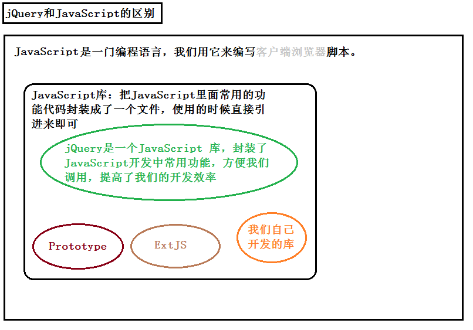

# 入口函数
- jQuery入口函数的两种写法
```javascript
    //第一种写法
    $(document).ready(function() {
        });
    //第二种写法
    $(function() {
        
    });
```
- 对比JavaScript的入口函数jQuery的入口函数,执行时机
    - 1.JavaScript的入口函数要等到页面中所有资源（包括图片、文件）加载完成才开始执行。
    - jQuery的入口函数只会等待文档树加载完成就开始执行，并不会等待图片、文件的加载。
```javascript
	    // DOM中的入口函数执行时机：页面完全加载后（结构，图片，文件）
		window.onload = function () {
			console.log('DOM的入口函数');
		};

		// jQuery的入口函数执行时机：结构加载完毕后执行
		// jQuery入口函数的书写方式：
		$(document).ready(function () {
			console.log('jQuery的入口函数1');
		});
		$(function () {
			console.log('jQuery的入口函数2');
		});


		// 如果需要使用jQuery设置页面完全加载后执行操作，可以使用以下形式：
		$(window).load(function () {
			console.log('这是jQuery在页面加载后执行的操作');
		});
```


## jQuery提供了两个定级对象


```javascript
        // $ jQuery
		// 实际上$和jQuery是同一个对象，只不过起了两个名字
		console.log($ === jQuery); // true

		// 2 $ 实际上是一个函数
		console.log(typeof $); // 'function'

		// $根据传入的参数形式不同，会具有不同的功能

		$('div'); // 选择器
		$(function () {}); // 入口函数
		$(document); // 可以让一个DOM对象具有更多的功能
```

## 了解jQuery的$符号

- **$是什么**

    `其实$就是一个函数：$();参数不一样，功能不一样`

$常用的几种情况：
```javascript
    $(function() {});//参数是function，说明是入口函数
    $("#btnSetConent");//参数是字符串，并且以#开头，是一个标签选择，查找id=“btnSetContent”的元素
    $("div");//查找所有的div元素
    $(document).ready(funciton(){})//将document转换成jQuery对象
```
补充:

`$ === jQuery,也就是说能用$的地方，完全可以用jQuery，$仅仅是简写形式。`


## jQuery对象与DOM对象之间的转换


- 1.什么是DOM对象？
	- DOM对象：通过DOM方式获取的页面元素。
	- jQuery对象：通过jQuery方式获取的页面元素。

使用JavaScript中的方法获取页面中的元素返回的对象就是dom对象。比如使用document.getElement*系列的方法返回的就是dom对象。


- 2 DOM对象和jQuery对象的关系
	- jQuery对象是伪数组形式，内部放置了DOM对象
	- 我们称jQuery对象是DOM对象的包装集。
```javascript
        var box = document.getElementById('box');
		var $box = $('div');
			console.dir(box);
			console.log($box);

```

- 3.功能的区别：
	- DOM对象只能使用DOM的功能，无法使用jQuery功能
	- jQuery对象只能使用jQuery功能，不能使用DOM功能
```javascript
        box.text('这是box');
		$box.innerHTML = '这是box的内容';
```

- 4 DOM对象与jQuery对象的转换方式
- 4.1 将DOM对象转换为jQuery对象:将DOM对象传入到$()中
```javascript
        $(box).text('这是新内容');
 ```
- 4.2 将jQuery对象转换为DOM对象
    - 利用索引取出jQuery对象中的DOM对象(推荐)
```javascript
        $box[0].innerHTML = '这是box的新内容';
        利用get(索引)
        $box.get(0).innerHTML = '这也是新内容';
 ```


## 什么是jquery对象？


- jquery对象就是使用jquery的方法获取页面中的元素返回的对象就是jQuery对象。比如使用$()方法返回对象都是jquery对象。
```javascript
    $("div");//标签选择器返回的jquery对象。
    $("#btnShowDiv");//id选择器返回的jquery对象。
```
jquery对象只能使用jquery对象的方法
```javascript
    var $obj = $("div");
    $obj.html("jquery对象设置文本的方法");
    $obj.show();//jquery对象显示文本
    $obj.click(function() {});//jquery对象绑定事件
```
错误的用法
```javascript
    $("div").innerHTML;//jquery对象不能调用dom方法
    //dom对象不能调用jquery方法。
    document.getElementById("btnShowDiv").show();
```

## 深入了解jQuery对象


- jQuery对象其实就是DOM对象的包装集（包装了DOM对象的集合）
  联想记忆：衣服和洗衣机的关系

## jQuery对象和DOM对象的相互转换


- 1. jquery对象转DOM对象
```javascript
    var $li = $("li");
    //第一种方法（推荐使用）
    $li[0]
    //第二种方法
    $li.get(0)
    //其实jQuery对象转DOM对象的实质就是取出jQuery对象中封装的DOM对象。
```

- 2. DOM对象转jquery对象（联想记忆：我有钱[美元]，所以我的功能就更强大）
```javascript
    var $obj = $(domObj);
    // $(document).ready(function(){});就是典型的DOM对象转jQuery对象
```


## 区分jQuery和JavaScript


- JavaScript是一门编程语言，jquery是用JavaScript实现的一个JavaScript库，目的是简化我们的开发。（联想记忆：不能扛着洗衣机去出差）
  